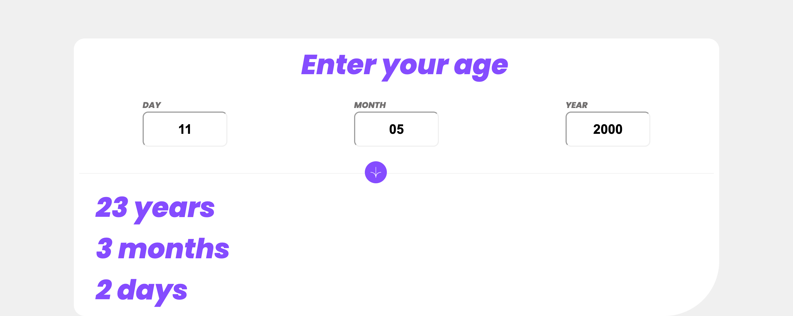

# Frontend Mentor - Age Calculator solution

## Overview

### The challenge

Users should be able to:

- View the optimal layout depending on their device's screen size
- Calculate their Age

### Screenshot

### Links

- Live Site URL: [Agecalc-marvis-dev.com](https://marvischief.github.io/Age-calc.github.io/)

## My process

### Built with

- Semantic HTML5 markup
- CSS custom properties
- Flexbox
- Mobile-first workflow

## Author

- Website - [Chief Marvis](https://www.github.com/Marvischief)
- Twitter - [@igbokwe_marvis](https://www.twitter.com/igbokwe_marvis)
